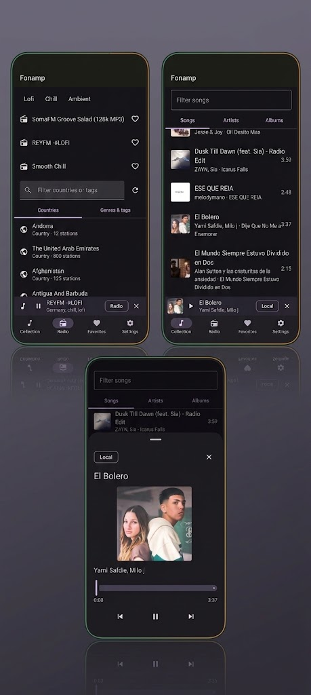

<!-- HERO SWAP: when the AI-generated raster hero is ready, change the src below
     from ./assets/readme/hero.svg to ./assets/readme/hero.png (one-line change). -->
<p align="center">
  
</p>

<h1 align="center">Fonamp</h1>

<p align="center">
  <a href="https://github.com/Juanstudy/fonamp/actions/workflows/android.yml"></a>
  <a href="https://github.com/Juanstudy/fonamp/releases"></a>
  
  
  
</p>

**fonamp** is a lightweight native Android player for an on-device MediaStore library and internet radio from RadioBrowser. It has no ads, trackers, analytics, or Firebase.

> [!NOTE]
> Current source and tag: **v0.0.13**. Releases are signed direct-install APKs for internal testing, not Play Store builds. See [CHANGELOG.md](./CHANGELOG.md) for shipped behavior by version.

## Shipped through v0.0.13

| Area | Current behavior |
| ---- | ---------------- |
| Local music | Songs, artists, and albums from MediaStore; local title/artist/album search; Coil album artwork |
| Radio | Country and genre/tag discovery, 24-hour cache, curated Lofi/Chill/Ambient tiles, debounced station-name search, Room favorites |
| Artwork | Local album art and RadioBrowser favicons with generic fallbacks in lists, mini-player, and full player sheet |
| Playback | One Media3 background player, local seek/next/previous, visible **Up next** queue, shuffle, repeat, playback speed, and a one-shot sleep timer |
| Continuity | Best-effort queue and position restore after process death, restored paused rather than auto-playing |
| Updates | Cold-start/manual GitHub release checks, APK download, completion notification, and system-installer handoff |
| Privacy | Seven-permission allowlist enforced in CI; no prohibited ad, analytics, crash, or Firebase SDKs |

## Screenshots

<p align="center">
  
</p>

*Historical real-device capture from v0.0.7. It does not show every feature added through v0.0.13.*

## Release and build facts

- The tag-triggered release workflow builds a **signed**, R8-optimized and resource-shrunk APK.
- The hard release gate is **<40 MB**. The last recorded measurement is **7.3 MB on 2026-09-12**; re-measure before quoting a current size.
- Debug builds stay unminified and are monitored rather than subject to the hard release-size gate.
- The manifest allowlist is `READ_MEDIA_AUDIO`, `READ_EXTERNAL_STORAGE` through API 32, `INTERNET`, `FOREGROUND_SERVICE`, `FOREGROUND_SERVICE_MEDIA_PLAYBACK`, `POST_NOTIFICATIONS`, and `REQUEST_INSTALL_PACKAGES` for update installation.

## Architecture

<p align="center">
  
</p>

One `app` shell wires navigation, Hilt, Media3, queue restore, and update installation. It hosts `feature/library`, `feature/radio`, and `feature/settings` over `provider/local`, `provider/api`, and `provider/radio`, with shared infrastructure in the five `core/*` modules. Favorites and theme are stored in Room; the radio directory uses a 24-hour file cache.

## Get it

**Users**

1. Open [GitHub Releases](https://github.com/Juanstudy/fonamp/releases).
2. Download `fonamp-<tag>.apk`.
3. Install on Android 10+ and allow the requested media/notification access.

**Developers**

```bash
./gradlew installDebug
./gradlew test
./scripts/audit-toolchain.sh
./scripts/audit-gates.sh
```

## Planned, not shipped

Podcasts, URL downloads/work queues, external music providers, tab customization, EQ, widgets, Android Auto, and public-store distribution remain roadmap work. They are not current app surfaces.
